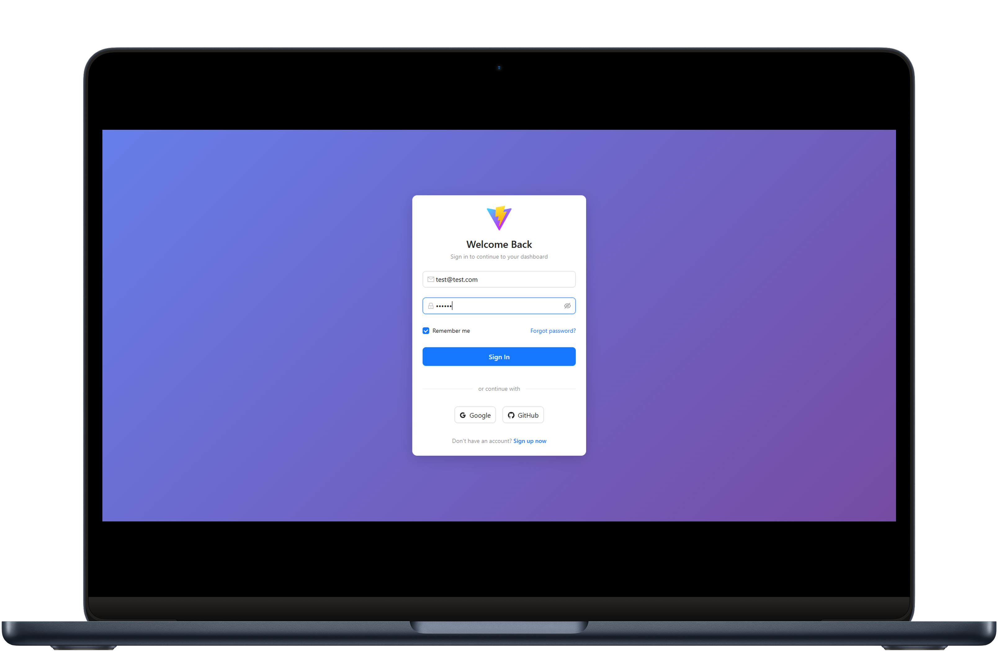
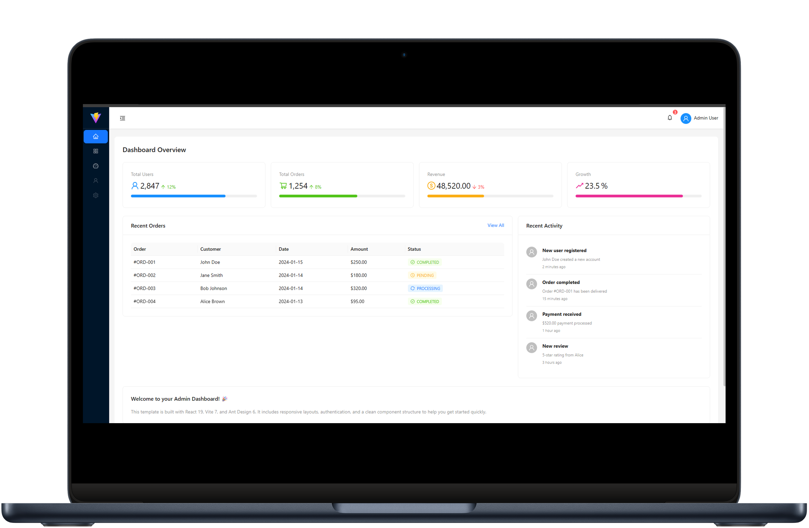
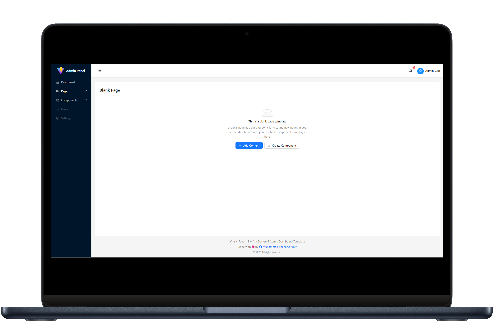
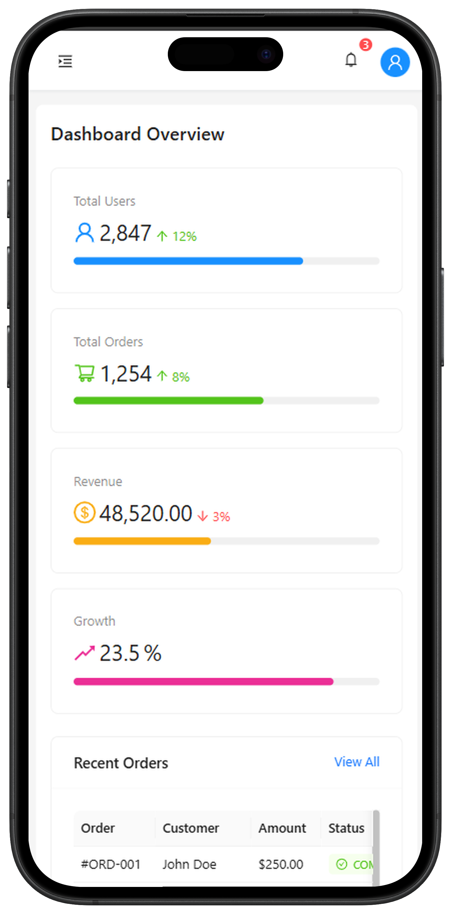
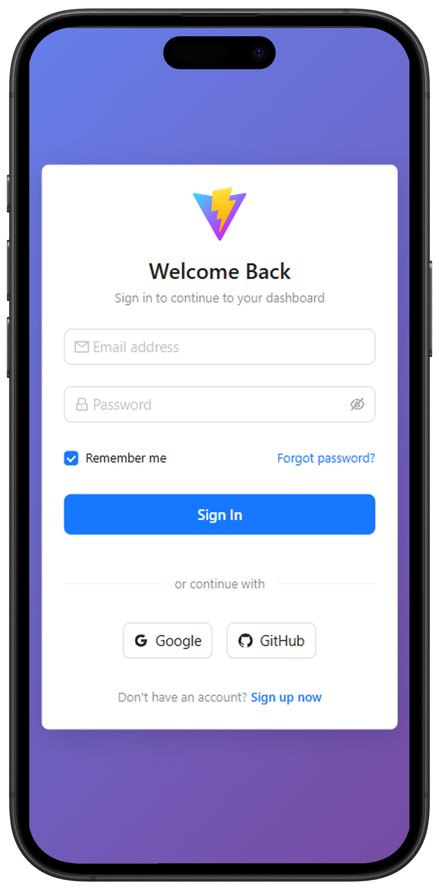

# 🚀 React Admin Dashboard Template

A modern, responsive, and production-ready admin dashboard template built with **React 19**, **Vite 7**, and **Ant Design 6**.


## ✨ Features

- 📱 **Fully Responsive** - Works seamlessly on desktop, tablet, and mobile devices
- 🎨 **Modern UI** - Clean and professional design using Ant Design 6
- ⚡ **Lightning Fast** - Powered by Vite 7 for instant HMR and optimized builds
- 🔐 **Authentication Ready** - Built-in protected routes and auth flow
- 🎯 **TypeScript Ready** - Includes TypeScript type definitions
- 📊 **Dashboard Components** - Pre-built stats cards, tables, and lists
- 🌙 **Theme Support** - Easy to customize with Ant Design's theming system
- 📦 **Minimal Dependencies** - Only essential packages included

## 📸 Preview

### Dashboard


### Sign In Page


### Dashboard with Sidebar Collapsed


### Mobile View
| Dashboard | Menu |
|-----------|------|
|  |  |

## 🛠️ Tech Stack

| Technology | Version | Description |
|------------|---------|-------------|
| [React](https://react.dev/) | 19.2 | UI Library |
| [Vite](https://vitejs.dev/) | 7.3 | Build Tool |
| [Ant Design](https://ant.design/) | 6.1 | UI Component Library |
| [React Router](https://reactrouter.com/) | 7.10 | Client-side Routing |

## 📁 Project Structure

```
src/
├── assets/          # Static assets (images, icons, etc.)
├── layout/          # Layout components
│   ├── MainLayout.jsx      # Main dashboard layout
│   ├── LayoutHeader.jsx    # Top navigation header
│   ├── LayoutSidebar.jsx   # Side navigation (responsive drawer on mobile)
│   ├── LayoutMenu.jsx      # Navigation menu items
│   ├── LayoutLogo.jsx      # Logo component
│   └── LayoutFooter.jsx    # Footer component
├── pages/           # Page components
│   ├── auth/
│   │   └── SignIn.jsx      # Sign in page
│   ├── home/
│   │   └── Home.jsx        # Dashboard home page
│   └── blank/
│       └── Blank.jsx       # Blank page template
├── Utils/           # Utility functions
│   └── Auth/
│       ├── SignIn.jsx      # Sign in logic
│       └── Logout.jsx      # Logout logic
├── App.jsx          # Root component with routes
├── ProtectedRoute.jsx  # Route protection HOC
├── main.jsx         # Application entry point
├── App.css          # Global app styles
└── index.css        # Base styles
```

## 🚀 Quick Start

### Prerequisites

- Node.js 18+ 
- npm, yarn, or pnpm

### Installation

1. **Clone the repository**
   ```bash
   git clone https://github.com/shehari007/antd-vite-react-admin-dashboard-template.git
   cd antd-vite-react-admin-dashboard-template
   ```

2. **Install dependencies**
   ```bash
   npm install
   # or
   yarn install
   # or
   pnpm install
   ```

3. **Start development server**
   ```bash
   npm run dev
   ```

4. **Open your browser**
   Navigate to `http://localhost:5173`

### Build for Production

```bash
npm run build
```

### Preview Production Build

```bash
npm run preview
```

## 📝 Available Scripts

| Script | Description |
|--------|-------------|
| `npm run dev` | Start development server |
| `npm run build` | Build for production |
| `npm run preview` | Preview production build |
| `npm run lint` | Run ESLint |

## 🔐 Authentication

The template includes a basic authentication flow:

- **Sign In Page** - Located at `/signin`
- **Protected Routes** - Dashboard routes require authentication
- **Auth Storage** - Uses localStorage for demo purposes

To customize authentication:
1. Modify `src/Utils/Auth/SignIn.jsx` for login logic
2. Modify `src/Utils/Auth/Logout.jsx` for logout logic
3. Update `src/ProtectedRoute.jsx` for route protection

## 🎨 Customization

### Theming

Customize the theme by modifying the Ant Design theme tokens. Create a theme configuration in your `App.jsx`:

```jsx
import { ConfigProvider } from 'antd';

<ConfigProvider
  theme={{
    token: {
      colorPrimary: '#1890ff',
      borderRadius: 6,
    },
  }}
>
  {/* Your app */}
</ConfigProvider>
```

### Adding New Pages

1. Create a new component in `src/pages/`
2. Add the route in `src/App.jsx`
3. Add menu item in `src/layout/LayoutMenu.jsx`

## 🤝 Contributing

Contributions are welcome! Please feel free to submit a Pull Request.

1. Fork the project
2. Create your feature branch (`git checkout -b feature/AmazingFeature`)
3. Commit your changes (`git commit -m 'Add some AmazingFeature'`)
4. Push to the branch (`git push origin feature/AmazingFeature`)
5. Open a Pull Request

## 📄 License

This project is licensed under the MIT License - see the [LICENSE](LICENSE) file for details.

## 👤 Author

**Muhammad Sheharyar Butt**

- GitHub: [@shehari007](https://github.com/shehari007)
- Email: shehariyar@gmail.com

## 🙏 Acknowledgments

- [Ant Design](https://ant.design/) - Amazing UI components
- [Vite](https://vitejs.dev/) - Next generation frontend tooling
- [React](https://react.dev/) - The library for web and native user interfaces

---

<p align="center">
  Made with ❤️ by <a href="https://github.com/shehari007">Muhammad Sheharyar Butt</a>
</p>

<p align="center">
  ⭐ Star this repo if you find it helpful!
</p>
