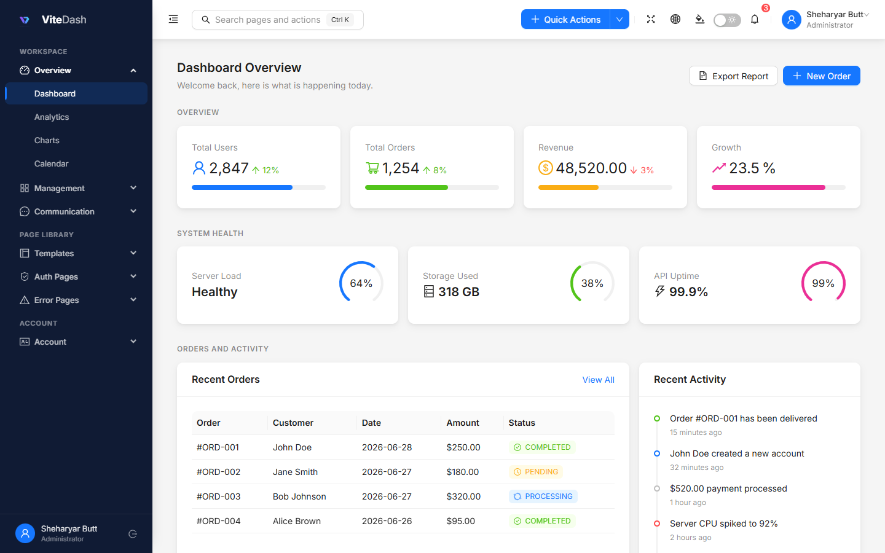
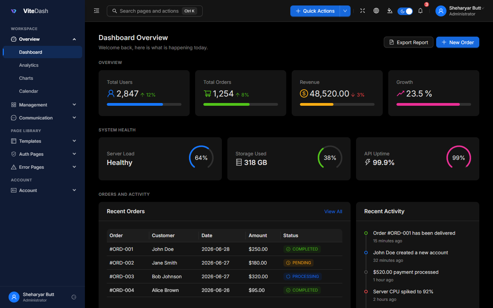
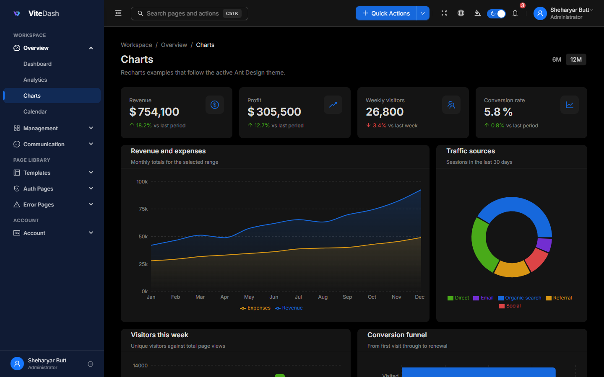
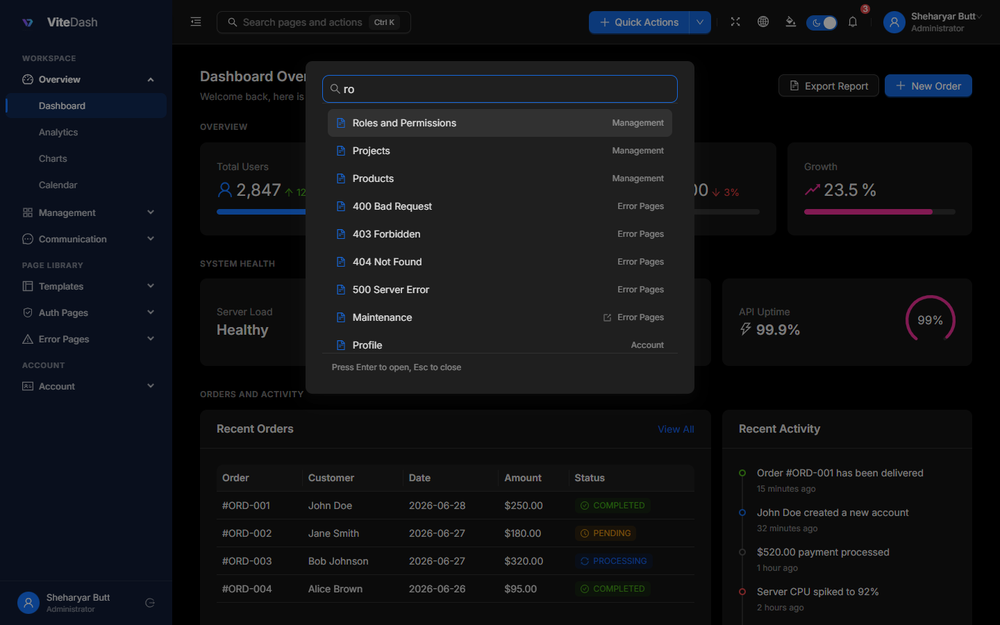
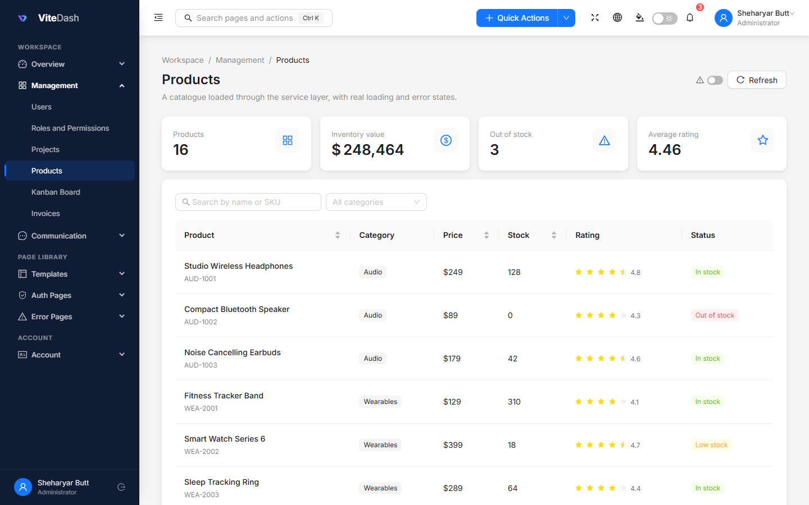
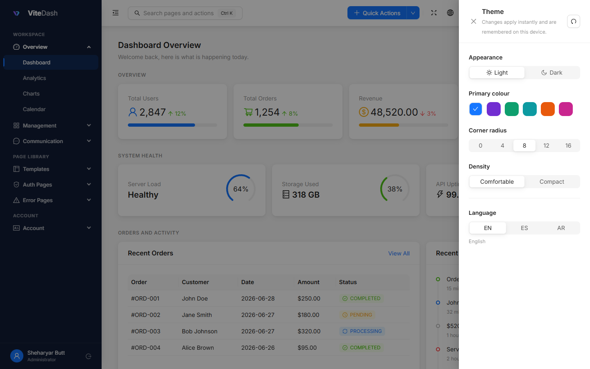
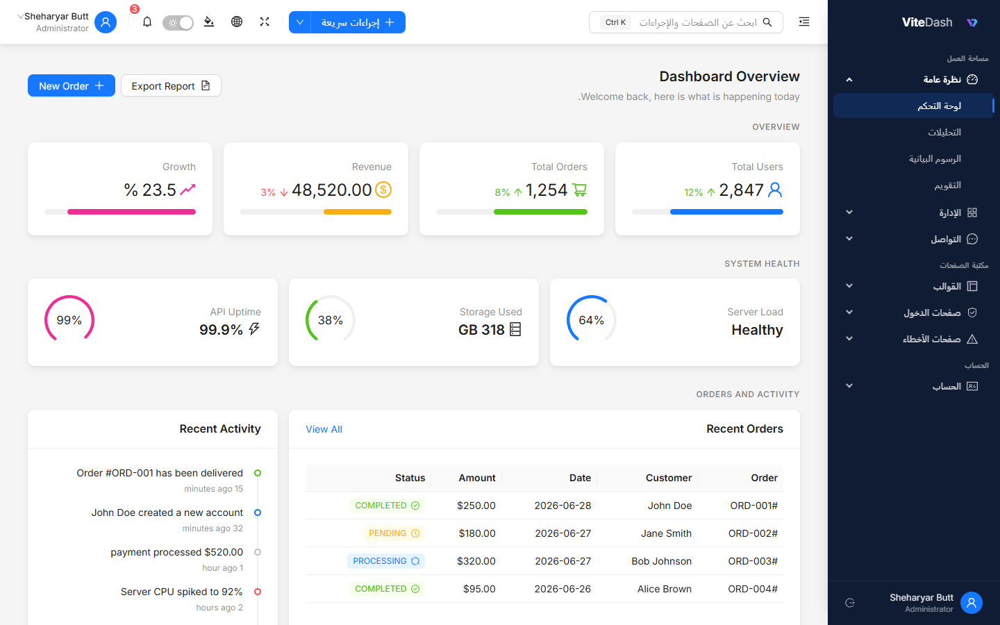
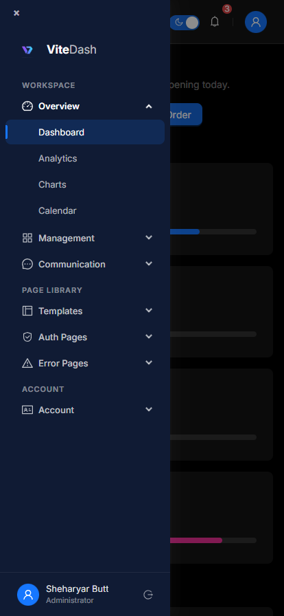

<p align="center">
  
</p>

<h1 align="center">ViteDash</h1>

<p align="center">
  A modern, responsive, production ready admin dashboard template built with
  <b>React 19</b>, <b>Vite 8</b>, and <b>Ant Design 6</b>.
</p>

<p align="center">
  
  
  
  
  
  
</p>

<p align="center">
  <a href="https://vitedash.msyb.dev"><b>Live demo</b></a>
  &nbsp;·&nbsp;
  <a href="#quick-start">Quick start</a>
  &nbsp;·&nbsp;
  <a href="#guides">Guides</a>
  &nbsp;·&nbsp;
  <a href="CHANGELOG.md">Changelog</a>
</p>

---

## Screenshots

<p align="center">
  
  
</p>

<p align="center">
  <em>Light and dark are the same components, re-themed by Ant Design's algorithm rather than by a second stylesheet.</em>
</p>

<p align="center">
  
  
</p>

<p align="center">
  <em>Charts that follow the active theme, including the tooltip. Ctrl+K searches every page you have access to.</em>
</p>

<p align="center">
  
  
</p>

<p align="center">
  <em>A list screen wired through the service layer, and live theme controls that persist across reloads.</em>
</p>

<p align="center">
  
  
</p>

<p align="center">
  <em>Arabic mirrors the entire layout, sidebar included. On mobile the rail becomes a drawer.</em>
</p>

## Why this template

Most free dashboard templates give you pages. This one also gives you the
plumbing every admin app needs on day two:

- **It loads fast.** Every route is code split. First load is 324 kB gzipped,
  and the chart library only downloads when you open a chart page.
- **It has roles.** Route guards, a sidebar that hides what the current user
  cannot open, and a permission matrix page to show how it fits together.
- **It has a data layer.** Mock services shaped exactly like a real API, so
  swapping in `fetch` changes one file and no components.
- **It speaks three languages,** including a right to left one, and the whole
  layout mirrors properly.
- **It is tested.** 48 tests, and `npm run check` runs lint, format, and tests
  in one command.
- **It stays readable.** Plain JavaScript and JSX, no TypeScript, no state
  management library, no build magic. If this is your first React project you
  can read every file in it.

## Features

**Layout and navigation**

- Three navigation states: a full sidebar on desktop, a persistent icon rail on
  tablet, and a drawer on mobile
- A sidebar built on one geometric rule so collapsing is pure clipping with no
  icon drift. See [The 40px axis](#the-40px-axis)
- Automatic breadcrumbs derived from the navigation tree
- Command palette on Ctrl+K or Cmd+K, searching every page you are allowed to see

**Theming**

- Light and dark mode through Ant Design's `ConfigProvider` algorithm, not CSS
  overrides, so every component re-themes itself
- A customizer drawer for the primary colour, corner radius, and density
- Every choice persists to localStorage and starts from your OS preference
- Full `prefers-reduced-motion` support, in CSS and in antd's motion token

**Application**

- Sign in, sign up, forgot password, and a lock screen
- Role based access control with route guards and role aware navigation
- Service layer with loading, error, and empty states on every screen
- Charts that follow the active theme, including the tooltip
- English, Spanish, and Arabic, with right to left layout
- Error boundaries so one broken page cannot blank the app

**Engineering**

- 25 pages, all built from Ant Design components
- Vitest and Testing Library, with `@testing-library/jest-dom`
- ESLint including accessibility rules, plus Prettier
- Bundle analysis with `npm run analyze`
- Deploy configs for Vercel, Netlify, and Docker with nginx

## Quick start

You need **Node 20.19 or newer**. The version is pinned in `.nvmrc` if you use
`nvm`.

```bash
git clone https://github.com/shehari007/vitedash-vite-antd-dashboard-template.git
cd vitedash-vite-antd-dashboard-template
npm install
cp .env.example .env
npm run dev
```

Open <http://localhost:5173>. The dashboard opens straight away, no sign in
needed, because `VITE_REQUIRE_AUTH` defaults to false.

To start a fresh project without the git history:

```bash
npx degit shehari007/vitedash-vite-antd-dashboard-template my-dashboard
```

### Scripts

| Script                  | What it does                                |
| ----------------------- | ------------------------------------------- |
| `npm run dev`           | Start the dev server on port 5173           |
| `npm run build`         | Production build into `dist/`               |
| `npm run preview`       | Serve the production build locally          |
| `npm run lint`          | ESLint, including accessibility rules       |
| `npm run lint:fix`      | ESLint with autofix                         |
| `npm run format`        | Rewrite files with Prettier                 |
| `npm test`              | Run the tests once                          |
| `npm run test:watch`    | Run the tests in watch mode                 |
| `npm run test:coverage` | Tests with a coverage report                |
| `npm run analyze`       | Build plus a bundle treemap in `stats.html` |
| `npm run check`         | Lint, format check, and tests together      |

## Project structure

```
src/
├── assets/logo/          Brand assets
├── components/           Shared building blocks used across pages
│   ├── charts/            ChartCard, themed tooltip, useChartTheme
│   ├── CommandPalette.jsx Ctrl+K search over the navigation tree
│   ├── EmptyState.jsx     "Nothing here yet"
│   ├── ErrorBoundary.jsx  Catches render errors, class component by necessity
│   ├── ErrorState.jsx     Inline "this request failed"
│   ├── PageHeader.jsx     Breadcrumb, title, subtitle, actions
│   ├── PageLoader.jsx     Suspense fallback
│   ├── RequireRole.jsx    Route level role gate
│   ├── SectionLabel.jsx   Quiet uppercase heading
│   ├── StatCard.jsx       Metric tile with a trend
│   └── ThemeCustomizer.jsx Live theme controls
├── config/appInfo.js     App name, version, links, env flags
├── context/              App wide state
│   ├── AuthContext.jsx    Session, sign in and out, lock, hasRole
│   ├── auth-context.js    Context object, roles, demo users
│   ├── useAuth.js         Hook
│   ├── ThemeModeContext.jsx ConfigProvider, tokens, direction, locale
│   ├── theme-mode-context.js Context object, sidebar geometry, presets
│   └── useThemeMode.js    Hook
├── data/                 Mock fixtures. Delete once your API is live
├── hooks/                useAsync, useDebouncedValue
├── i18n/                 i18next setup and locale JSON
├── layout/               The application shell
│   ├── DashboardLayout.jsx Auth gate, error boundary, Suspense
│   ├── MainLayout.jsx      Responsive state and collapse persistence
│   ├── AuthLayout.jsx      Split screen for the auth pages
│   ├── LayoutHeader.jsx    Header, search, language, customizer, account
│   ├── LayoutSidebar.jsx   Sider on desktop and tablet, Drawer on mobile
│   ├── LayoutMenu.jsx      Renders the tree and the collapsed flyouts
│   ├── LayoutLogo.jsx      Mark and wordmark, immobile during collapse
│   ├── LayoutUserCard.jsx  Account card at the foot of the rail
│   ├── LayoutFooter.jsx    Footer
│   └── navConfig.jsx       The navigation tree and everything derived from it
├── pages/                One folder per page
├── services/             The API boundary. Replace these with real calls
├── test/                 Vitest setup and render helpers
├── App.jsx               Routes, with every page lazily imported
├── main.jsx              Entry point and provider stack
└── index.css             Base styles and the sidebar design system
```

## Guides

### Adding a page

Four small steps:

**1.** Create `src/pages/reports/Reports.jsx`:

```jsx
import PageHeader from '@/components/PageHeader';
import { Card } from 'antd';

const Reports = () => (
  <>
    <PageHeader title="Reports" subtitle="Everything worth knowing" />
    <Card>Your content</Card>
  </>
);

export default Reports;
```

**2.** Add the lazy import and the route in `src/App.jsx`:

```jsx
const Reports = lazy(() => import('@/pages/reports/Reports'));
// ...
<Route path="reports" element={<Reports />} />;
```

**3.** Add it to a group in `src/layout/navConfig.jsx`:

```jsx
{ to: '/dashboard/reports', labelKey: 'nav.items.reports' },
```

**4.** Add `"reports": "Reports"` under `nav.items` in **every** file in
`src/i18n/locales/`.

The breadcrumb, the sidebar entry, and the command palette all pick it up
automatically.

To restrict it to a role, add `roles: ['admin']` to the nav entry and wrap the
route:

```jsx
<Route element={<RequireRole roles={[ROLES.ADMIN]} />}>
  <Route path="reports" element={<Reports />} />
</Route>
```

### Theming

Theming goes through Ant Design's `ConfigProvider`. There are no dark mode CSS
classes anywhere in this project.

Read or change the theme from any component:

```jsx
import { useThemeMode } from '@/context/useThemeMode';

const { mode, isDark, toggleMode, primaryColor, setPrimaryColor, direction } = useThemeMode();
```

To change the defaults, edit the `token` and `components` objects in
`src/context/ThemeModeContext.jsx`. To add a colour to the customizer, add one
row to `PRIMARY_PRESETS` in `src/context/theme-mode-context.js` and it appears as
a swatch.

The sidebar deliberately stays dark in both modes. Its colours come from
`Menu.dark*` tokens rather than the active algorithm, so re-theming the app does
not re-theme the rail. Note that `darkItemBg`, `darkSubMenuItemBg`, and
`darkPopupBg` are three independent tokens. The last one paints the collapsed
hover flyouts, and leaving it unset is what makes flyouts render in Ant Design's
stock navy instead of your rail colour.

### Authentication and roles

Sign in with any of these, and any password:

| Email                 | Role   | What they see                               |
| --------------------- | ------ | ------------------------------------------- |
| `admin@vitedash.dev`  | admin  | Everything, including Roles and Permissions |
| `editor@vitedash.dev` | editor | Everything except Roles and Permissions     |
| `viewer@vitedash.dev` | viewer | Same as editor in this demo                 |

Any other email signs in as a viewer, so the demo never dead ends on a typo.

To require sign in, set `VITE_REQUIRE_AUTH=true` in `.env`. Every `/dashboard`
route then redirects to `/signin`, and the page the visitor originally wanted is
remembered and restored afterwards.

Replace the fake implementation in `src/services/authService.js` with real
calls. The shapes it returns are what the rest of the app already expects:

```js
export const signIn = async ({ email, password }) => {
  const response = await apiClient.post('/auth/login', { email, password });
  return { user: response.user, token: response.token };
};
```

Two things to keep in mind. The role checks here run in the browser, so they
stop honest users from wandering into the wrong page but stop nobody with the
developer tools open. Enforce the same rules on your server. And a token in
localStorage is readable by any script on the page, so prefer an httpOnly cookie
in production. There is more detail in [SECURITY.md](SECURITY.md).

### Connecting a real API

Everything that touches data lives in `src/services/`. Each function returns
mock data after a short delay, in the same shape a real endpoint would.

```js
// src/services/catalogService.js, before
export const getProducts = async (params) => {
  await delay(500);
  return { items, total, page, pageSize };
};

// after
import { apiClient } from './apiClient';

export const getProducts = (params) => apiClient.get(`/products?${new URLSearchParams(params)}`);
```

Nothing in `src/pages/` changes, because the pages use the `useAsync` hook and
never know where the data came from:

```jsx
const load = useCallback(() => getProducts({ search, page }), [search, page]);
const { data, loading, error, refresh } = useAsync(load);
```

Wrap the function in `useCallback`. Without it a new function on every render
makes the hook refetch forever.

`src/services/apiClient.js` is a small `fetch` wrapper with a base URL, JSON
handling, an auth header, and failed responses turned into thrown errors. Set
`VITE_API_BASE_URL` in `.env` to point it somewhere.

The Products page is the one to copy. It has search with debouncing, a category
filter, sorting, paging, an empty state, and a switch that makes the request
fail on purpose so you can see the error path.

### Internationalisation and right to left

Three languages ship: English, Spanish, and Arabic. Switch with the globe icon
in the header, or from Settings.

Use a translation in any component:

```jsx
import { useTranslation } from 'react-i18next';

const { t } = useTranslation();
<h1>{t('page.products.title')}</h1>;
```

To add a language, copy `src/i18n/locales/en.json`, translate the values, then
import it in `src/i18n/index.js` and add a row to `LANGUAGES`:

```js
{ code: 'fr', label: 'Français', shortLabel: 'FR', dir: 'ltr' }
```

Setting `dir: 'rtl'` is all that right to left needs. It flows into Ant Design's
`ConfigProvider`, which mirrors every component, and onto `<html dir>`, which
flips the CSS logical properties the layout is written with.

The application shell, the auth pages, and the newer pages are fully
translated. The older demo pages still have English body copy, because
translating placeholder marketing text into three languages would be a lot of
noise for very little value. Use `t()` for your own content as you replace them.

### Command palette

Press **Ctrl+K**, or **Cmd+K** on macOS. It searches every page in the
navigation tree, filtered by the current role, plus a few actions. Arrow keys
move, Enter opens, Escape closes.

New pages are indexed automatically. There is nothing to register.

### Environment variables

Copy `.env.example` to `.env`. Every variable exposed to the browser must start
with `VITE_`.

| Variable            | Default                | What it does                                |
| ------------------- | ---------------------- | ------------------------------------------- |
| `VITE_API_BASE_URL` | empty                  | Base URL for `apiClient`                    |
| `VITE_APP_VERSION`  | `package.json` version | Overrides the version in the footer         |
| `VITE_REQUIRE_AUTH` | `false`                | Set to `true` to gate every dashboard route |

Anything prefixed `VITE_` is compiled into the JavaScript bundle and is public.
Real secrets belong on your server, never here.

## Pages

| Page                  | Route                                 | Notes                                                |
| --------------------- | ------------------------------------- | ---------------------------------------------------- |
| Dashboard             | `/dashboard/home`                     | Stat cards, gauges, orders table, activity, team     |
| Analytics             | `/dashboard/analytics`                | Traffic sources, device breakdown, funnel, top pages |
| Charts                | `/dashboard/charts`                   | Recharts examples that follow the active theme       |
| Calendar              | `/dashboard/calendar`                 | Full calendar with upcoming events                   |
| Users                 | `/dashboard/users`                    | Searchable, filterable user table                    |
| Roles and Permissions | `/dashboard/roles`                    | Permission matrix. Admin only                        |
| Projects              | `/dashboard/tables`                   | Rich table with avatars, ratings, and progress       |
| Products              | `/dashboard/products`                 | Service layer, paging, filters, real error states    |
| Kanban Board          | `/dashboard/kanban`                   | Static board across four stages                      |
| Invoices              | `/dashboard/invoices`                 | Billing table with a detail drawer                   |
| Chat                  | `/dashboard/chat`                     | Contacts, requests, resizable panels                 |
| Notifications         | `/dashboard/notifications`            | Notification centre with read and unread             |
| Activity Log          | `/dashboard/activity`                 | Audit trail with filters and a timeline              |
| Forms                 | `/dashboard/forms`                    | Basic, advanced fields, and a multi step wizard      |
| Pricing               | `/dashboard/pricing`                  | Plan cards, comparison table, selection modal        |
| Help Center           | `/dashboard/faq`                      | Searchable FAQ with categories and a contact form    |
| Profile               | `/dashboard/profile`                  | Cover banner, stats, skills, activity, edit form     |
| Settings              | `/dashboard/settings`                 | General, appearance, security, notifications         |
| Blank Page            | `/dashboard/blank`                    | Starting point for new pages                         |
| Error Pages           | `/dashboard/errors/{400,403,404,500}` | Ready made error states                              |
| Sign In               | `/signin`                             | With demo accounts                                   |
| Sign Up               | `/signup`                             | With validation and a confirm password rule          |
| Forgot Password       | `/forgot-password`                    | With a success state                                 |
| Lock Screen           | `/lock`                               | Keeps the session, blocks the app                    |
| Maintenance           | `/maintenance`                        | Standalone page for planned downtime                 |

## Deployment

The build output in `dist/` is static files. Any host will serve it, as long as
unknown URLs fall back to `index.html`, which is what makes a refresh on
`/dashboard/products` work instead of 404ing.

**Vercel.** Import the repository. `vercel.json` already has the rewrite and the
cache headers.

**Netlify.** Import the repository. `netlify.toml` sets the build command, the
publish directory, the SPA redirect, and the headers.

**Docker.**

```bash
docker build -t vitedash .
docker run -p 8080:80 vitedash
```

A two stage build: Node compiles, then nginx serves. The final image is about
50 MB and contains none of your source code. The nginx config in `nginx.conf`
handles the SPA fallback, gzip, and caching.

**Anything else.** Run `npm run build` and upload `dist/`. Configure the host to
serve `index.html` for any path that is not a real file.

## Performance

The 2.2.0 build split every route out of the main bundle:

|                          | Before                | After                       |
| ------------------------ | --------------------- | --------------------------- |
| First load, uncompressed | 1,620 kB in one file  | 1,004 kB across 13 files    |
| First load, gzipped      | one chunk, everything | **324 kB**                  |
| Chart library            | loaded on every page  | only on `/dashboard/charts` |
| Total JavaScript         | 1,620 kB              | 2,182 kB across 83 chunks   |

The total is larger because the template gained charts, three locales, and seven
pages. What matters is that none of it loads until it is needed.

There is a comment in `vite.config.js` explaining why there is no
`manualChunks` configuration. In short: grouping all of antd into one chunk
sounds right and doubles the first load, from 324 kB to 643 kB gzipped. Run
`npm run analyze` before adding one back.

## Accessibility

- Visible keyboard focus everywhere, including the sidebar, where antd's own
  ring targets a selector that never matches because the label is wrapped in a
  link
- Every icon only button is labelled
- `aria-expanded` and `aria-controls` on the navigation toggle
- The command palette is a proper listbox with arrow key navigation
- `prefers-reduced-motion` honoured in both CSS and antd's `motion` token, since
  CSS alone cannot stop antd's JavaScript driven animations
- The selected menu item is tinted rather than solid, because on a solid primary
  pill the pastel group glyphs measured 1.8:1
- `eslint-plugin-jsx-a11y` runs as part of `npm run lint`, so the claims above
  are checked rather than asserted

## Testing

```bash
npm test
npm run test:coverage
```

48 tests across route matching, role filtering, the auth provider, the service
layer, `useAsync` race conditions, and the shared components. `src/test/setup.js`
stubs the browser APIs jsdom lacks, and `src/test/utils.jsx` exports
`renderWithProviders` for anything that needs the full provider stack.

## The 40px axis

The rail's geometry is built on one number: the horizontal centre of every icon,
identical whether the sidebar is 248px or 80px wide. Collapsing therefore clips
the labels away instead of re-laying out the menu.

Ant Design positions menu icons by two unrelated formulas:

```text
expanded  = itemMarginInline + inlineIndent + iconSize / 2
collapsed = collapsedWidth / 2
```

The constants in `src/context/theme-mode-context.js` are solved so both equal 40:

```text
8 + 24 + 8  ===  80 / 2  ===  40
```

Change any one of them and the icons will jump on collapse unless you re-solve
the identity. Two things to know if you do:

- `inlineIndent` is a Menu **prop**, not a theme token. rc-menu writes
  `padding-left` as an inline style attribute, which beats every class rule, so
  `itemPaddingInline` cannot move the expanded icon.
- Keep `collapsedIconSize >= iconSize`. Ant Design's collapsed rule overrides the
  icon's `font-size` but not its `min-width`, so a larger `iconSize` would widen
  the glyph box past what the centring calculation assumes.

There is a test in `src/context/theme-mode-context.test.js` that fails if the
identity is broken.

## Tech stack

| Technology                               | Version | Role              |
| ---------------------------------------- | ------- | ----------------- |
| [React](https://react.dev/)              | 19.2    | UI library        |
| [Vite](https://vitejs.dev/)              | 8.1     | Build tool        |
| [Ant Design](https://ant.design/)        | 6.5     | Component library |
| [React Router](https://reactrouter.com/) | 7.18    | Routing           |
| [Recharts](https://recharts.org/)        | 3.10    | Charts            |
| [i18next](https://www.i18next.com/)      | 26      | Translations      |
| [Vitest](https://vitest.dev/)            | 4.1     | Tests             |

## Contributing

Contributions are welcome, and small pull requests get merged fastest. Read
[CONTRIBUTING.md](CONTRIBUTING.md) first, then:

1. Fork the project
2. Create your branch (`git checkout -b feature/thing`)
3. Make the change and run `npm run check`
4. Commit and push
5. Open a pull request

## License

MIT. See [LICENSE](LICENSE).

## Author

Muhammad Sheharyar Butt

- GitHub: [@shehari007](https://github.com/shehari007)
- Email: [shehariyar@gmail.com](mailto:shehariyar@gmail.com)

## Acknowledgments

- [Ant Design](https://ant.design/) for the component library
- [Vite](https://vitejs.dev/) for the tooling
- [React](https://react.dev/) for the library everything is built on

<p align="center">
  Made with care by <a href="https://github.com/shehari007">Muhammad Sheharyar Butt</a>
</p>

<p align="center">
  Star this repo if you find it helpful.
</p>
